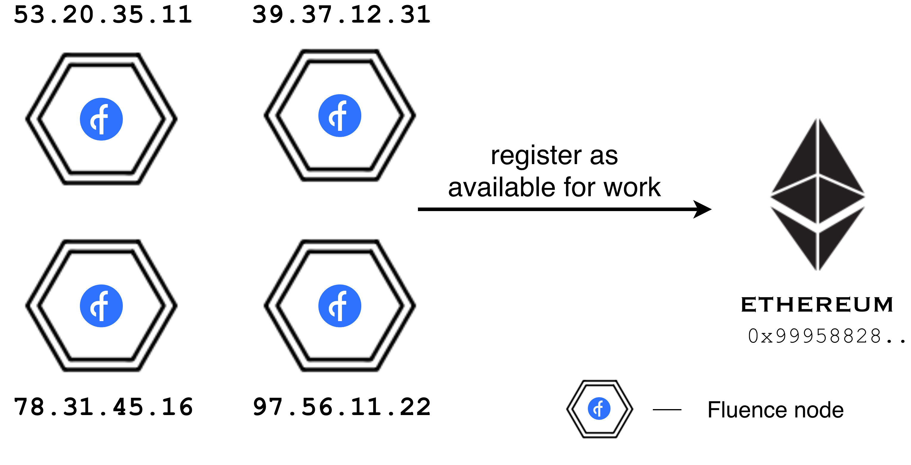
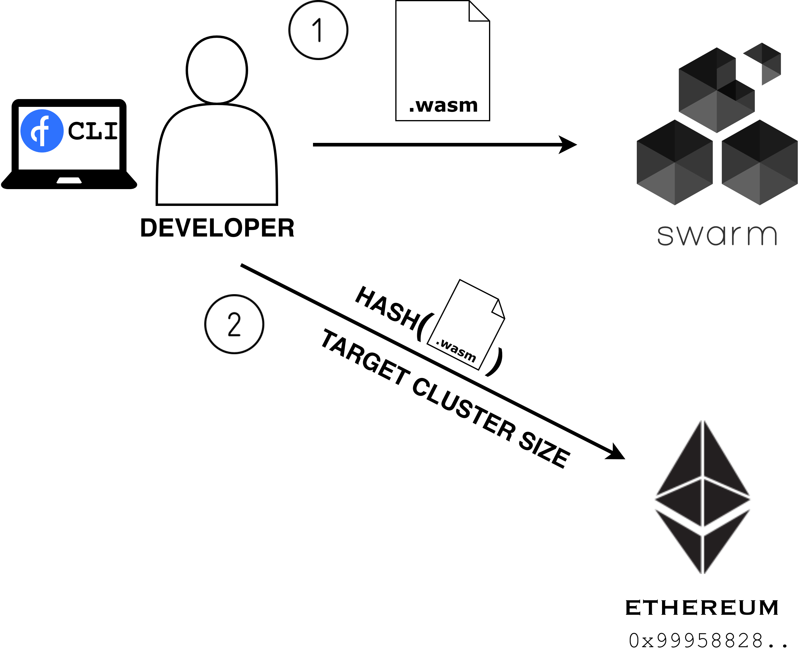
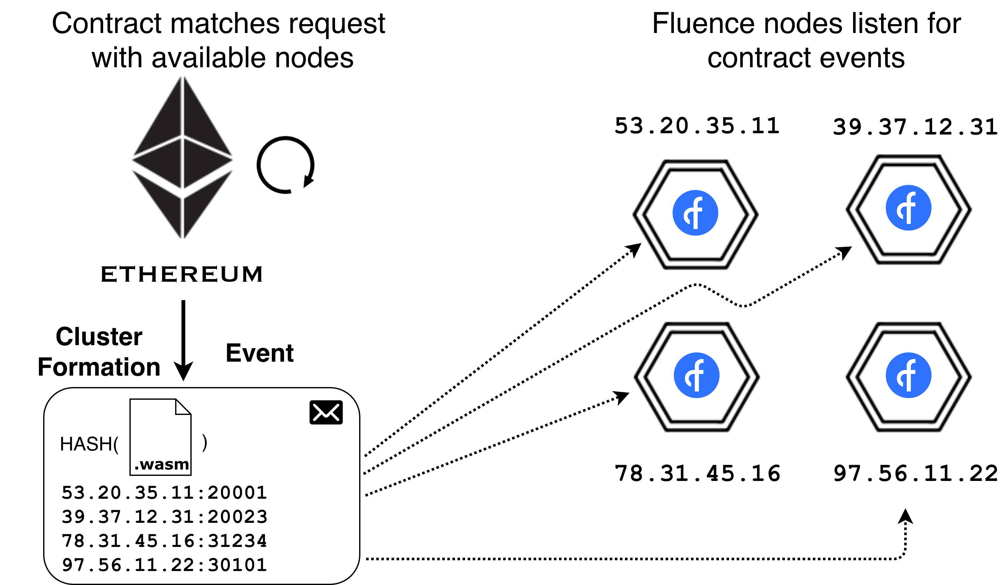
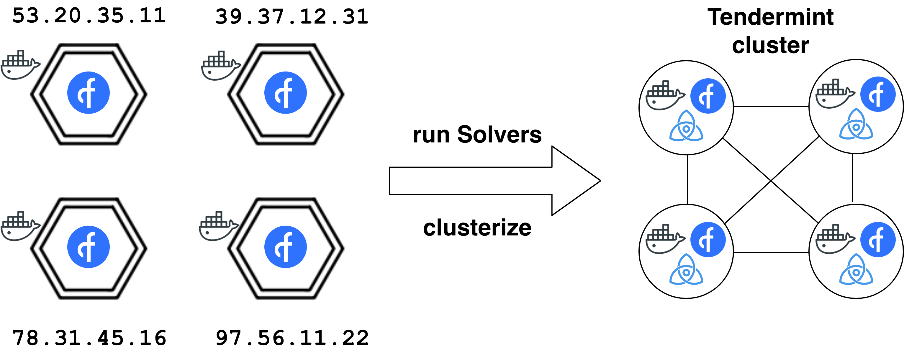

## Fluence Demo: December 2018
This demo will allow you to play with Fluence Nodes and Real-Time Clusters. You will run Fluence from scratch, manage it through Ethereum smart contract, create real-time clusters with decentralized database written in Rust, and use it through HTTP API with a simple web application.

### Prerequisites
**NOTE:** _`docker-compose.yml` works only on macOS. If you would like to run it on other OS, you will need to change `host.docker.internal` to respective IP addresses._

You will need installed `Docker` and `npm`.

### Scenario
First of all, clone this repo
```
git clone https://github.com/fluencelabs/demo-2018-dec
```

Then, go to `bootstrap` directory and run Ganache blockchain:
```
cd bootstrap
npm install
npm run ganache > /dev/null
npm run migrate
```

Note the contract address in the output, you will need it later:
```
Deployer: 0x9995882876ae612bfd829498ccd73dd962ec950a
```

Another piece of hex you will need is current Ethereum account in Ganache:
```
# while in bootstrap directory
npm run getEthAccount
```

Now it's time to run Swarm and 4 Fluence nodes! That's easy:
```
cd .. # go back to repository root directory
docker-compose up -dV
```

You can check out running containers by running `docker ps` in terminal. Also, if logs are of interest for you, run `docker logs --follow node1`. 

On start, nodes will register themselves in Ethereum contract at address `0x9995882876ae612bfd829498ccd73dd962ec950a`, signaling ready to get some work. See image below.
<div style="text-align:center">
<br>

<br><br><br>
</div>

To give these nodes work, we'll take (llamadb)[https://github.com/nukep/llamadb/], a database written in Rust, compiled to WebAssembly, and upload it to Swarm. Resulting address should be sent to Ethereum contract along with the cluster size we wish to be serving our code. 

<div style="text-align:center">
<br>

<br><br><br>
</div>

We'll use [Fluence CLI](https://github.com/fluencelabs/fluence/tree/master/cli) for that:
```
# while in repository root directory
fluence-cli publish llama_db.wasm 0x9995882876ae612bfd829498ccd73dd962ec950a 0x4180fc65d613ba7e1a385181a219f1dbfe7bf11d -cluster_size 4
```

You may take a look at `fluence-cli publish --help` to get the idea of how to use it.

After we published code, Ethereum contract will match the code to registered nodes and emit an event singaling them to form real-time cluster.

<div style="text-align:center">
<br>

<br><br><br>
</div>


Event contains addresses and ports of all four future cluster members. On receiving an event, nodes will run real-time nodes in docker containers, specifying peers in the configuration files. Note that all containers are running on the host, there is no Docker-in-Docker here.

<div style="text-align:center">
<br>

<br><br><br>
</div>

You may take a look at real-time node's logs `docker logs --follow 01_node2`. Look for `height=2`, that means that Tendermint produced 2 initial blocks and cluster is ready to receive transactions.

Now let's run a simple web application which will connect to real-time cluster through [Javascript Fluence library](https://github.com/fluencelabs/fluence/tree/master/js-client). Go to `sql-client` and open `index.html` in a web browser.
